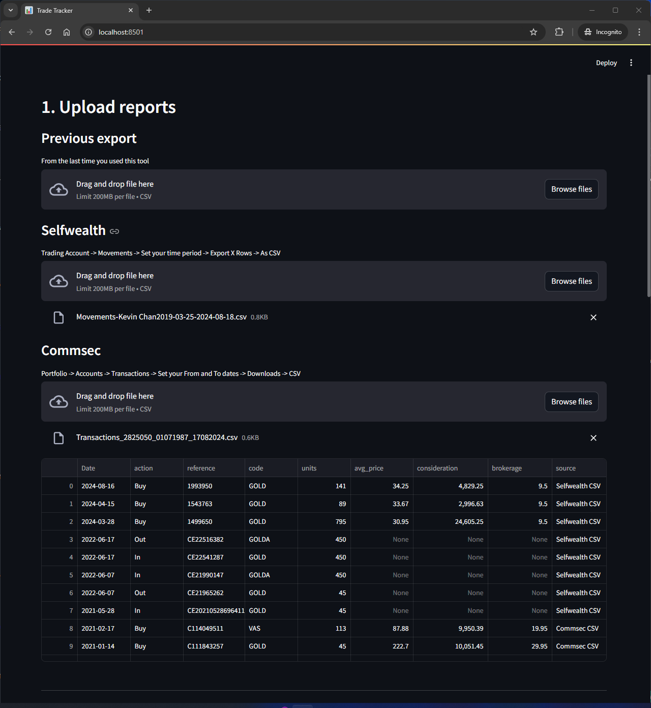
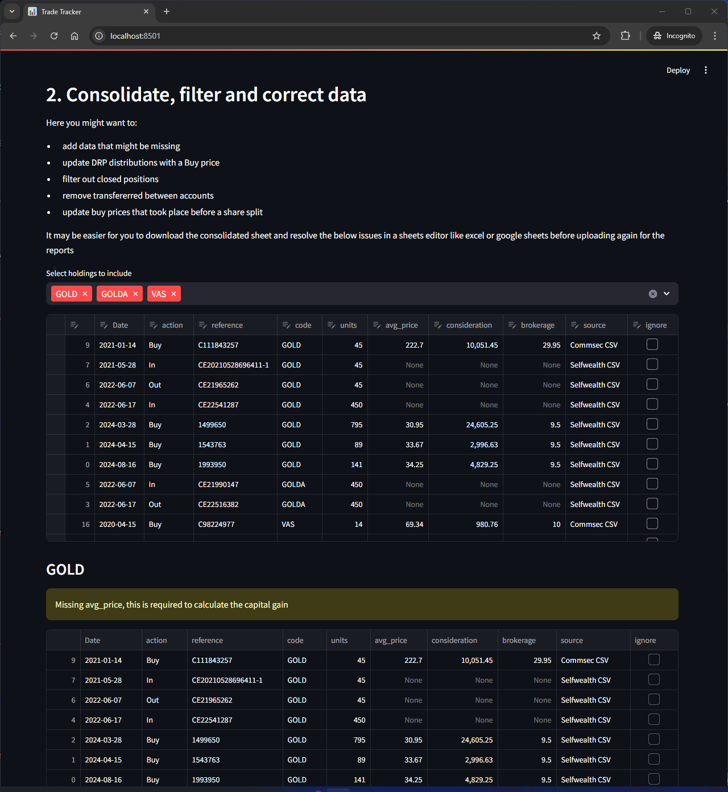
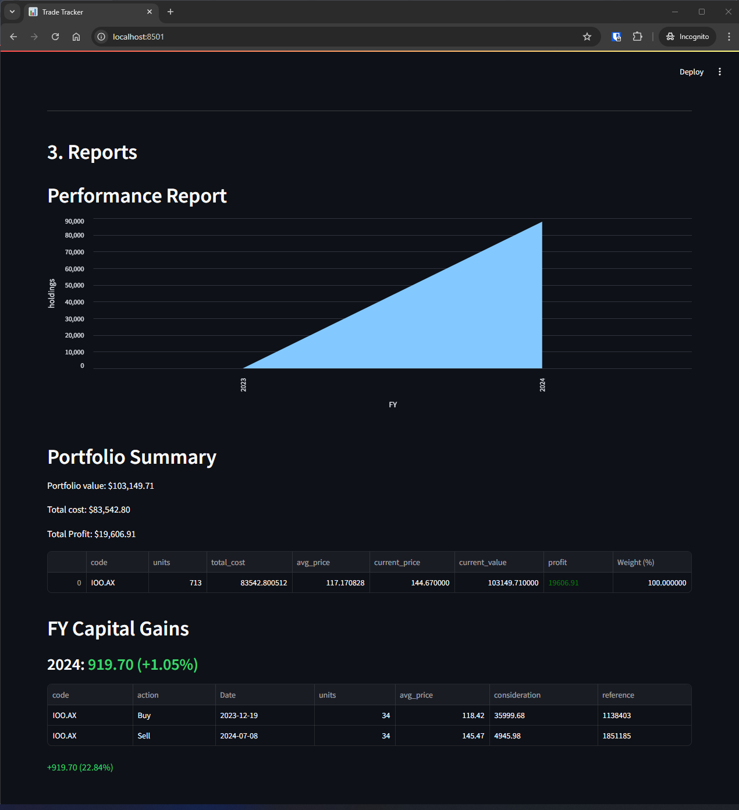

# CapitalGains

# Import CSVs from brokers

# Consolidate trades into a standard format

# Performance Reports and Trade reconcilliation 

## Running Locally
- `pipenv install -r requirements.txt`
- `streamlit run main.py`

## Running in Docker
- `docker build -t capitalgains .`
- `docker run -p 8501:8501 capitalgains`

## Development: Running in Docker Volume
- `docker build -t capitalgains .`
- `docker run -v $(pwd)/app:/app -p 8501:8501 capitalgains`
